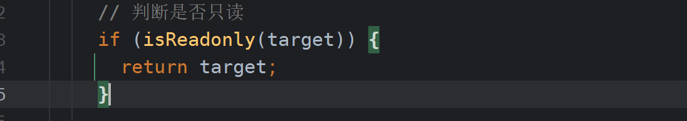
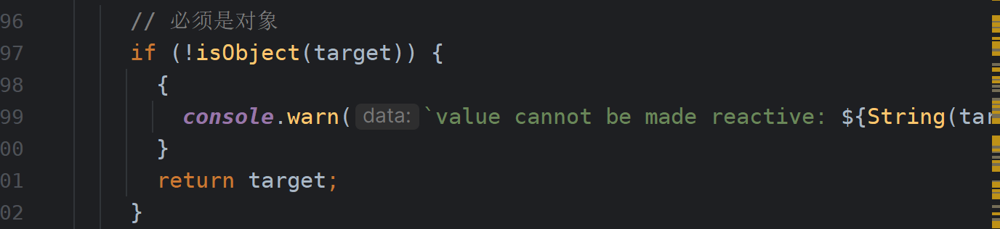
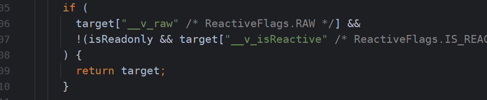
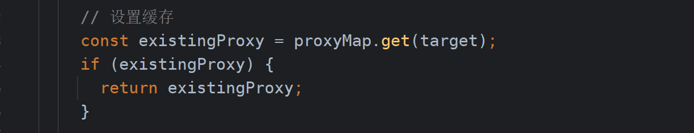
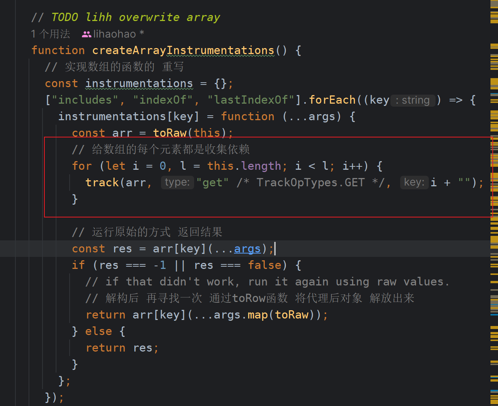
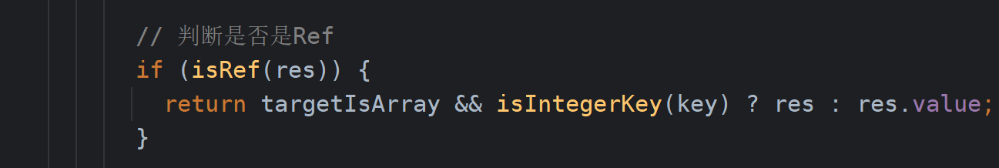
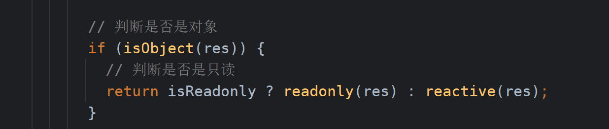
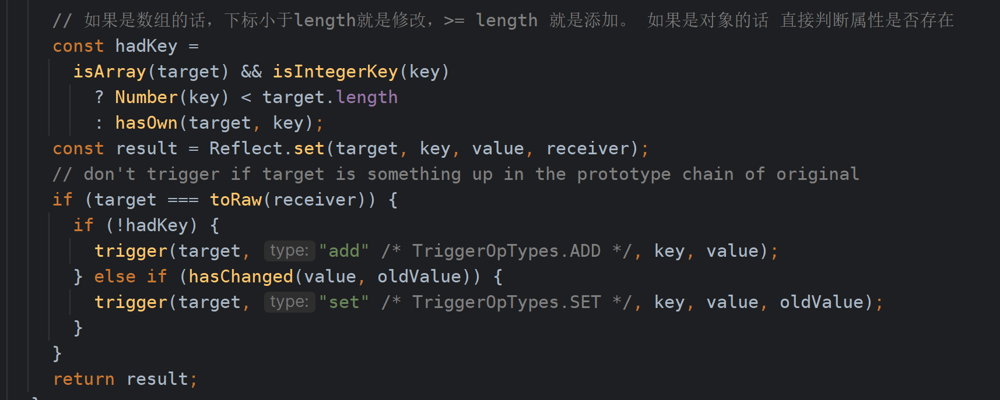

## 3.2 Reactive 分析

### 3.2.1 标识

> 可以根据下面的标识来搜寻代码。代码中详细的写注释了，可以根据入口来寻找

- `TODO lihh Reactive entry` reactive 入口
- `TODO lihh overwrite array` reactive 数组函数重写
- `TODO lihh getter` reactive getter 实现部分
- `TODO lihh setter` reactive setter 实现部分

### 3.2.2 大致流程

### 3.2.3 内部细节点

- 判断是否是只读的

- reactive 函数内的内容必须是对象

- 是否已经被代理过

- 将代理后的proxy 进行缓存

- 代理元素是数组 && 使用includes API

> 如果存在一个数组：`const arr = reactive([1,2,3])`等。 在template模板中使用了`arr.includes(1)`
> 源码中会将每个元素都进行依赖收集，目的就是为了下次数组发生变化，再次进行includes判断

- 如果reactive中 嵌套ref的使用情况

> 如果我们在编写代码过程中出现了reactive嵌套ref的时候，我们其实不需要`obj.count.value`这么写的。
> 直接使用`obj.count`就可以了。内部会判断如果是ref的话，直接给我们.value了

- reactive响应式 是具有惰性的

- 在setter方法中 如果判断是新增以及修改呢

